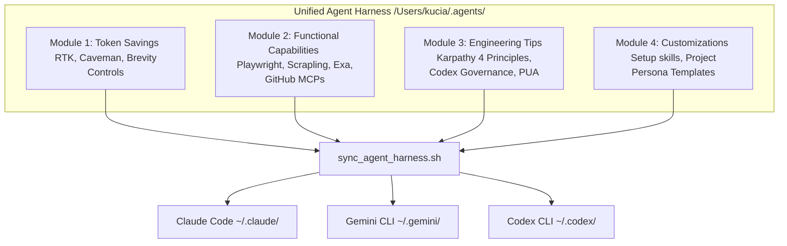

# Unified Agent Harness (UAH): Modular Integration Plan

This plan organizes the configuration settings, skills, and tools for **Claude Code**, **Antigravity CLI (Gemini CLI)**, and **Codex CLI** into structured, reusable modules. The goal is to create a unified developer agent harness where capabilities, tools, tips, and customization can be easily managed and synchronized.

---

## 1. Modular Architecture



---

## 2. Module Classification & Specifications

### Module 1: Token Savings (节省 Token 模块)
Optimizes context length, minimizing token usage and costs during agent actions.
* **RTK (Rust Token Killer)**: Command interception hook. Proxies heavy shell utilities (`git`, `grep`, `find`, `ls`) to their lightweight `rtk` wrapped equivalents (saving 60-90% tokens).
* **Caveman Mode (`caveman`)**: A strict prompt instruction (loaded as a shared skill) forcing ultra-compressed, direct, and compact language, dropping conversational filler.
* **Output Brevity Constraints**: Custom rules configuring the model to output brief, targeted summaries.

### Module 2: Functional Capabilities & Tools (功能与工具模块)
Equips the agent with browser, crawler, search, and API capabilities.
* **Playwright (`playwright` / `webapp-testing`)**: Executes browser automation, reads DOM state, captures UI screenshots, and handles interactive web app testing.
* **CloakBrowser (`cloakbrowser` / `cloakbrowser-mcp`)**: A stealth Chromium binary fork featuring 50+ source-level patches. Directly replaces Playwright/Puppeteer's browser executable to pass advanced bot detection (e.g. Cloudflare Turnstile, reCAPTCHA v3, FingerprintJS) during agent browser sessions.
* **Scrapling (`scrapling`)**: Adaptive python crawler. Configured as an MCP server (`scrapling mcp`) to scrape JavaScript-heavy or bot-protected websites stealthily, returning targeted Markdown sections to minimize token overhead.
* **Exa Search (`exa`)**: Semantic, neural web search MCP returning clean text summaries without page downloads.
* **GitHub MCP (`github`)**: Full management of repositories, issues, branches, and Pull Requests.
* **Context7 (`context7`)**: Fast API documentation query tool.
* **Memory (`memory`)**: Local knowledge-base SQLite and vector database MCP to query long-term developer memories.


### Module 3: Engineering Tips & Discipline (技巧与工程规范模块)
Enforces a highly disciplined engineering persona on the LLM to prevent code slop.
* **Andrej Karpathy's Four Principles**:
  1. *Think Before Coding*: Force the agent to state assumptions and evaluate tradeoffs before editing.
  2. *Simplicity First*: Write minimal code; reject premature abstractions.
  3. *Surgical Changes*: Limit edits to target boundaries; avoid adjacent formatting or refactoring.
  4. *Goal-Driven Execution*: Write tests first; verify edits run successfully before claiming completion.
* **Codex Governance**:
  * Templates for `PROJECT_PLAN.md`, `plans/<task>/plan.md`, `pdca.md`, and `handoff.md`.
  * Standard loop closure checks.
* **PUA Escalation Loops**: Strict triggers (e.g. 2+ failed attempts) shifting the agent into a deeper diagnostic mode.

### Module 4: Customizations & Personas (定制化与角色模块)
Dynamic project-specific rules and environmental integrations.
* **Matt Pocock Setup Skills**: Integrates local issue trackers and repository metadata files (`CLAUDE.md`, `GEMINI.md`, `AGENTS.md`).
* **Shared Master Governance file (`GOVERNANCE.md`)**: Merges Module 3 rules into a central rulebook, referenced globally by all 3 CLIs.

---

## 3. Configuration Sync Matrix

| Module | Component | Claude Code Config | Gemini/Antigravity Config | Codex CLI Config |
| :--- | :--- | :--- | :--- | :--- |
| **Token Savings** | **RTK Hook** | `PreToolUse` hook in `settings.json` | `BeforeTool` hook in `settings.json` | Configured via environment/shell aliases |
| **Token Savings** | **Caveman Mode** | `caveman` skill linked in `~/.claude/skills` | `caveman` skill linked in `~/.gemini/config/skills` | `caveman` skill linked in `~/.codex/skills` |
| **Capabilities** | **Playwright MCP** | Registered in `.mcp.json` | Registered in `mcpServers` (`settings.json`) | Registered in `[mcp_servers]` (`config.toml`) |
| **Capabilities** | **CloakBrowser MCP** | Registered in `.mcp.json` | Registered in `mcpServers` (`settings.json`) | Registered in `[mcp_servers]` (`config.toml`) |
| **Capabilities** | **Scrapling MCP** | Registered in `.mcp.json` | Registered in `mcpServers` (`settings.json`) | Registered in `[mcp_servers]` (`config.toml`) |
| **Capabilities** | **Exa / GitHub MCP** | Registered in `.mcp.json` | Registered in `mcpServers` (`settings.json`) | Registered in `[mcp_servers]` (`config.toml`) |
| **Tips & Rules** | **Karpathy + Codex Gov** | Reference in `~/.claude/CLAUDE.md` | Symlink `~/.gemini/GEMINI.md` to `GOVERNANCE.md` | Reference in `~/.codex/AGENTS.md` |
| **Tips & Rules** | **PUA loops** | `pua` skill linked | `pua` skill linked | `pua` skill linked |


---

## 4. Next Implementation Steps (All Completed)

1. **Build Master Rulebook**: Written to `/Users/kucia/.agents/GOVERNANCE.md` combining Karpathy Principles, Codex Governance, and RTK rules. (Completed)
2. **Hook Rulebook to CLIs**:
   * Symlink `~/.gemini/GEMINI.md` to `/Users/kucia/.agents/GOVERNANCE.md`. (Completed)
   * Reference the file in `~/.claude/CLAUDE.md` and `~/.codex/AGENTS.md`. (Completed)
3. **Register MCP Servers (Scrapling + Playwright + Exa + Memory)**:
   * Wrote globally to `~/.gemini/settings.json` and `~/.codex/config.toml`. (Completed)
4. **Draft Sync Script (`sync_agent_harness.sh`)**:
   * Created at `~/sync_agent_harness.sh` to automate links validation and verification. (Completed)

---

## 5. Verification & Execution Logs

We ran the synchronization script on June 6, 2026:
```bash
chmod +x ~/sync_agent_harness.sh && ~/sync_agent_harness.sh
```
Output results:
```
=========================================
🔄 Starting Agent Harness Synchronization
=========================================
📄 Syncing Governance Rulebook links...
  - Link created: ~/.gemini/GEMINI.md -> /Users/kucia/.agents/GOVERNANCE.md
  - Added GOVERNANCE.md reference to ~/.claude/CLAUDE.md
  - Added GOVERNANCE.md reference to ~/.codex/AGENTS.md
⚙️  Syncing agent skills...
  [Skills] Linked: artifacts-builder
  [Skills] Linked: brand-guidelines
  [Skills] Linked: canvas-design
  [Skills] Linked: changelog-generator
  [Skills] Linked: competitive-ads-extractor
  ...
  [Skills] Linked: webapp-testing
  [Skills] Linked: twitter-algorithm-optimizer
  [Skills] Linked: video-downloader
  [Skills] Linked: zoho-books-automation
🛡️  Verifying CLI configuration files...
  - [Hook] Gemini RTK Hook is correctly configured.
  - [MCP] Gemini Scrapling MCP is correctly configured.
  - [MCP] Codex Scrapling MCP is correctly configured.
=========================================
✅ Synchronization Finished Successfully!
=========================================
```
All custom configurations have been modularly integrated, synchronized, and verified across all three environments!

